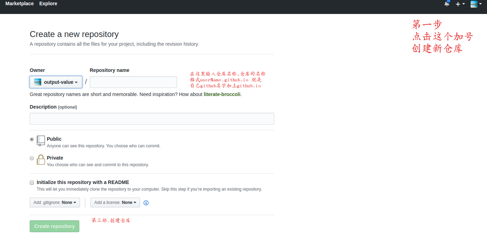

学习怎么搭建一个属于自己的博客,保存自己点点滴滴

## 如何搭建自己的博客呢? 
-----

### 准备工作

1. **github账号** 因为我们的博客是基于github搭建的
2. **git** 用来提交自己的文章到互联网,

### 开始

1. 在github创建一个仓库,仓库的格式是 **userName.github.io** [userName]是自己的github的名字
   
2. 把创建的仓库给clone到本地,在本地的仓库放index.html
    1. 也就是把本地的文件夹和github关联起来,以后是要把自己写的文章放到这里的
3. 在本地的文件夹写一个简单的**index.html**文件,然后用git上传到github
4. 访问 **https://userName.github.io** 就能看到自己刚才写的内容了,记得把username换成自己第一步创建的仓库名称


### 最后

1. 我们可以用网上的模板来创建自己的博客 <a href="http://jekyllthemes.org/" style="font-size:22px">点击查看</a>
2. 把下载的模板放到自己的本地目录,
3. 找到模板的 **_posts**文件夹这里就是自己要写的文章了
4. 注意文章的格式如下 **2019-01-01-title.md**  要不然会不识别的
5. ```java
    ---
    layout: post
    title: 教你怎么搭建一个属于自己的博客
    author: 默默无闻
    ---
6. 如上展示的是文章的头信息部分,**layout**表示文章显示的模板用哪个, **title**就是文章的标题了 **author** 就是作者名字
7. 没个模板可能也不一样,要自己慢慢的摸索了
8. 最后把所以改好的都提交到github然后等一下查看之前的博客地址就能看到改变了