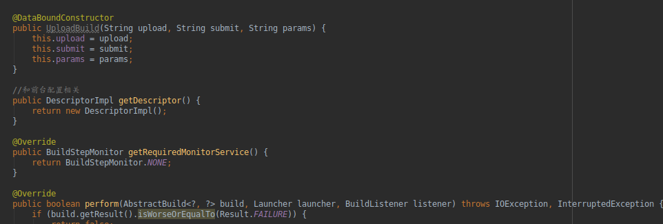

学习jenkins的插件开发,可以更好的满足自己工作的需求

## 必备知识

1. 有一定java基础
2. 会用jenkins参数构建Android的apk包

## 插件应用场景

利用jenkins打包,并且把打包之后的apk文件上传(当然也适合其他的文件上传),最主要的是保存构建过程中的参数.
之前项目想保存构建参数,都是把参数传递到项目的 `gradle.properties` 然后保存这些参数,这样其实项目和打包的过程就无法分离了.

## 环境

1. Linux
2. maven
3. IDEA
4. JDk1.8(测试证明1.9以上的jdk会有问题)

## 开始

1. 修改 ～/.m2/settings.xml 内容如下(windows找到对应的`m2`目录)
    ```<settings>
        <pluginGroups>
            <pluginGroup>org.jenkins-ci.tools</pluginGroup>
        </pluginGroups>

        <profiles>
            <!-- Give access to Jenkins plugins -->
            <profile>
            <id>jenkins</id>
            <activation>
                <activeByDefault>true</activeByDefault> <!-- change this to false, if you don't like to have it on per default -->
            </activation>
            <repositories>
                <repository>
                <id>repo.jenkins-ci.org</id>
                <url>https://repo.jenkins-ci.org/public/</url>
                </repository>
            </repositories>
            <pluginRepositories>
                <pluginRepository>
                <id>repo.jenkins-ci.org</id>
                <url>https://repo.jenkins-ci.org/public/</url>
                </pluginRepository>
            </pluginRepositories>
            </profile>
        </profiles>
        <mirrors>
            <mirror>
            <id>repo.jenkins-ci.org</id>
            <url>https://repo.jenkins-ci.org/public/</url>
            <mirrorOf>m.g.o-public</mirrorOf>
            </mirror>
        </mirrors>
        </settings> 

2. 执行命令
    ```
    mvn -U archetype:generate -Dfilter=io.jenkins.archetypes
    可能需要翻墙,中间会跳出几个选项,认真选择,最主要的第一步是模板选4(demo模板),第二步选1.4版本

3. 在生成的模板里边有一个文件`HelloWorldBuilder.java` 这里可以实现不同时期的扩展点,如果SCm(源码管理),Builder(构建步骤),Trigger(构建触发),Publisher(构建之后执行的操作).这里我们选择Recorder(就是Publisher的一个子类)
4. 主要实现有个几个如图个方法,第一个方法就是构造器,会把jenkins的页面数据通过构造器传过来(怎么写页面我们下一步再说),第二个方法getDescriptor也可以理解为和前台页面相关的一个配置类,保存用户输入的配置信息,并在必要的时候恢复用户的信息,其实就是保存在一个xml文件里边了.第三个方法如图返回就行,第四个方法就是我们真正执行逻辑的地方
   
5. 在上一步中perform执行方法,一般我们需要获取到执行信息.然后执行具体的逻辑,比如获取到当前页面的插件输入信息,这个比较简单,已经通过构造器拿过来了.获取到其他的参数就是用 
    ```
    EnvVars environment = build.getEnvironment(listener);
    String str= environment.get("SERVICE_TYPE","0");
    SERVICE_TYPE是参数名,通过这个方法拿到全局的其他配置信息

6. 最后一步就是前段页面开发了.jenkins用的是jelly开发的前端页面,这个不会写也重要,直接看着模板的例子比葫芦画瓢就可以了,主要参数名称要和前边的构造器的参数名字一样,这样才能形成映射关系

7. 至此jenkins插件开发主要的流程已经结束,集体的开发就和java web类似了,在pom文件引用不同的库做开发就可以了,jenkins 流程问题比较难搞,也就是环境配置,一旦配置完成开发还是比较简单的

8. 个人开发的一个jenkins插件[https://github.com/output-value/jenkins-upload]可以作为一个简单的参考

## 参考文章

1. 官方安装说明[https://jenkins.io/doc/developer/tutorial/prepare/]
2. 前辈文章[https://www.jianshu.com/p/8c05b6191d2f]