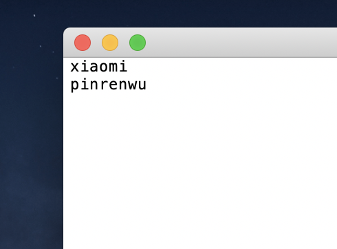
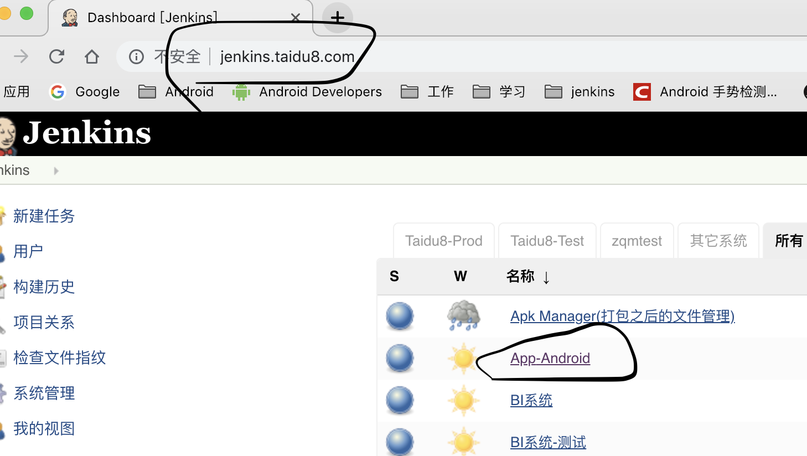
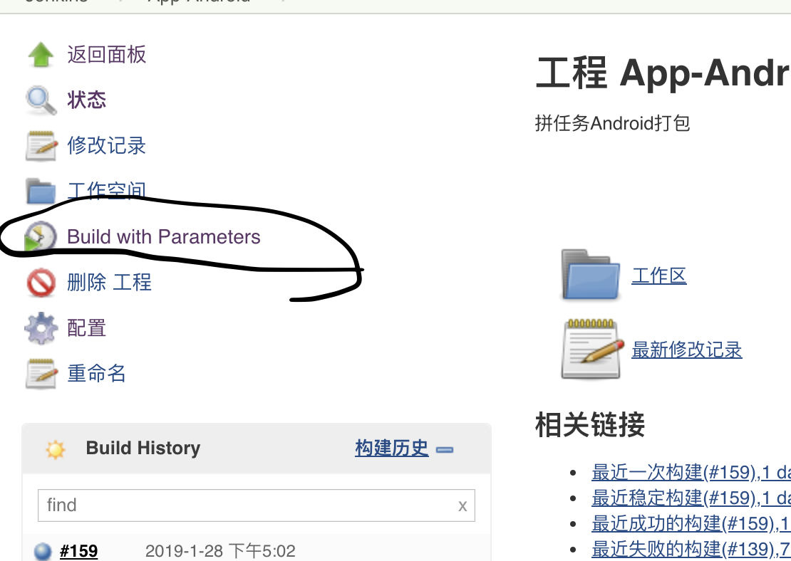
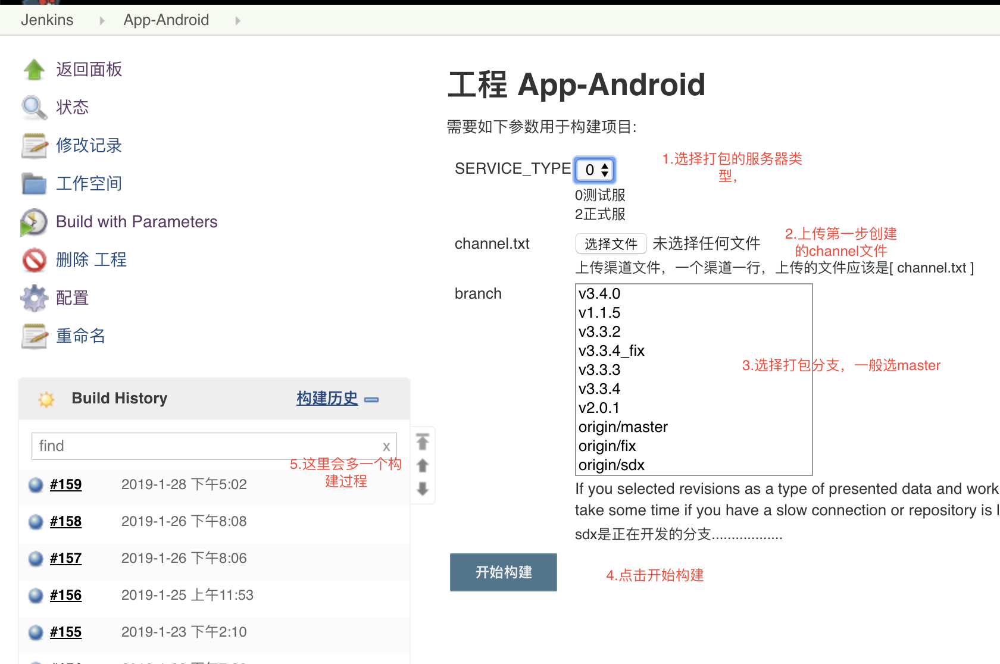
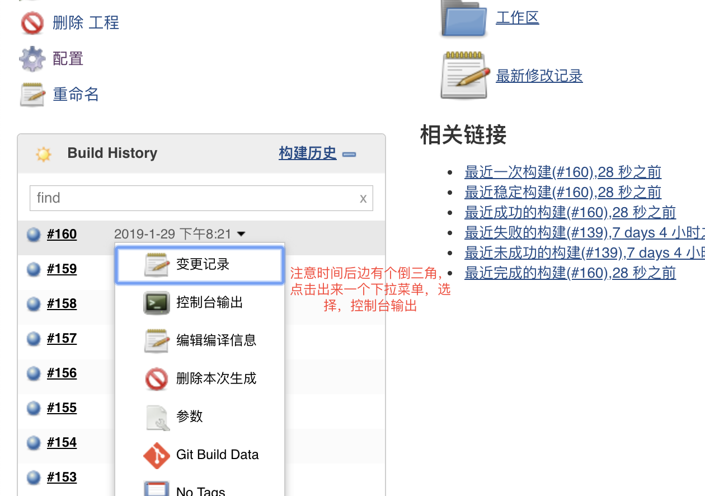
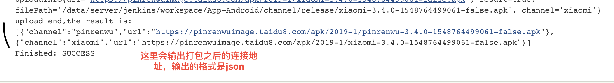

主要介绍自己内部的Android打包流程

1. 在本地创建一个```channel.text```的文件 
   
2. 打开文件输入要打的渠道名称，一个渠道一行，输入之后保存退出，比如要打```小米，拼任务```那么输入的内容应该是

3. [点我打开打包地址](http://jenkins.taidu8.com)，可以需要账号密码，另外通知 ，打开的页面如下找到```App-Android```点击打开


4. 点击左侧的 ```Build with Parameters```


5. 第五步是最关键的一步
    1. 选择需要的接口类型，
    2. 上传第一步创建的```channel.text```文件
    3. 选择打包的分支，一般选择```master```
    4. 点击开始构建
    5. 注意左边的构建历史

    

6. 经过第5步之后左边，左边的的构建历史就会多了一个构建中的进度条，
点击时间后边的 ***倒三角*** 图标然后选择 ***控制台输出***。或者直接点击改构建进度条，在打开的页面中选择 ***控制台输出***


7. 经过第6步之后我们看到一个构建输入的页面，等待构建打包之后我们把页面拉到最下边可以看到打包成功的 url 
    > 输出的格式是 **json** 格式，
    > 一般从 **upload end , the result is:** 开始
    > 到 **Finished：SUCCESS** 结束

    

8. 如果出现最后的结果不是 **Finished：SUCCESS** 那就是打包失败了